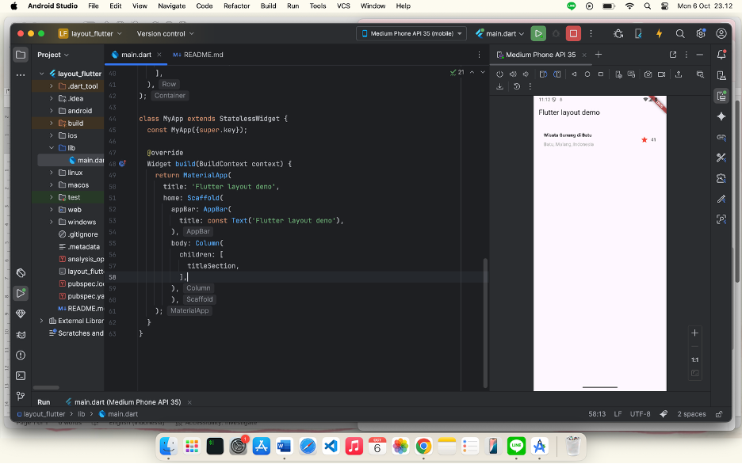
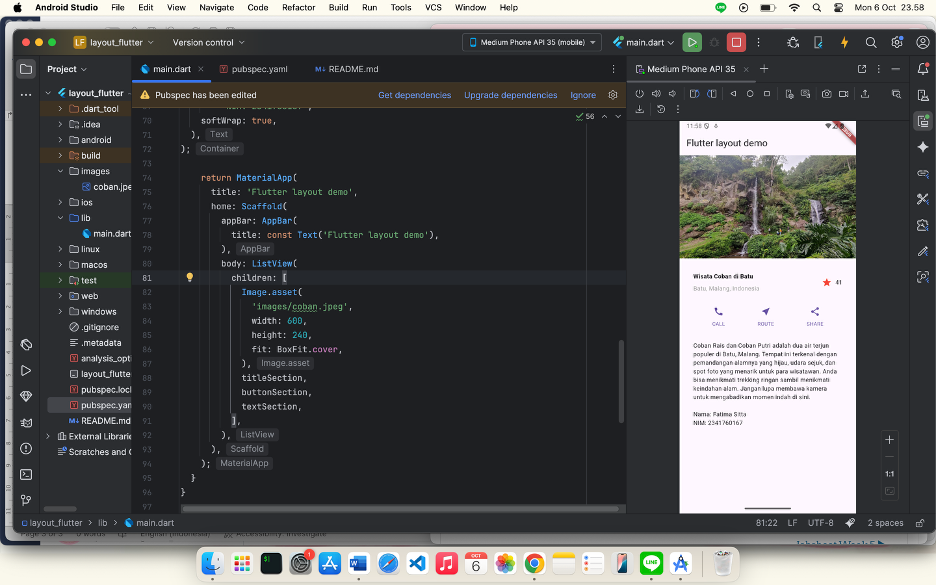
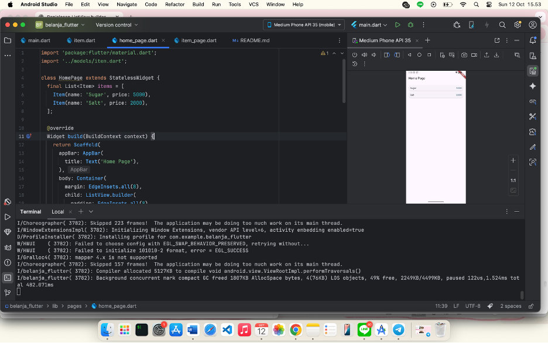
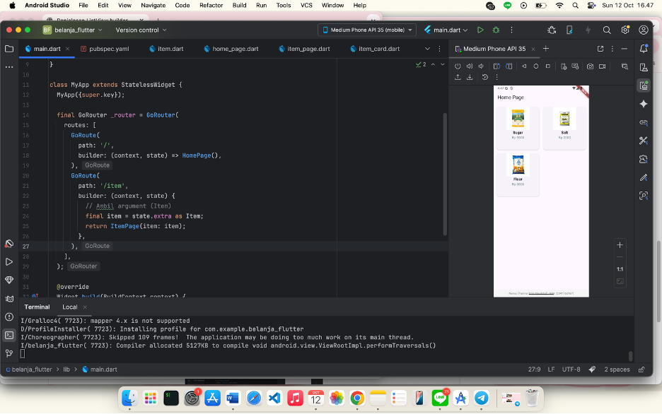

#### Nama: Fatima Sitta
#### NIM : 2341760167

# 🚀 Flutter Layout & Widget Project

Proyek ini merupakan aplikasi Flutter sederhana untuk mempelajari dasar-dasar Flutter serta penerapan beberapa widget penting, mulai dari layout, button, teks, hingga image section.

---

## 📸 Screenshot Perkembangan

### 1️⃣ Praktikum 1: Membangun Layout di Flutter

  

---

### 2️⃣ Praktikum 2: Implementasi Button Row

  

---

### 3️⃣ Praktikum 3: Implementasi Text Section

  

---

### 4️⃣ Praktikum 4: Implementasi Image Section

  

---

### 5️⃣ Praktikum 5: Membangun Navigasi di Flutter

  

---

## 🧭 Tugas Praktikum 2 — Aplikasi Belanja Flutter

Tugas ini merupakan pengembangan dari proyek Flutter sebelumnya dengan fitur tambahan berikut:
- ✅ Menggunakan **plugin `go_router`** untuk navigasi modern
- ✅ Tampilan **GridView** menyerupai marketplace
- ✅ Implementasi **Hero Animation** untuk efek transisi gambar produk
- ✅ Penambahan atribut produk: `foto`, `stok`, dan `rating`
- ✅ Footer dengan **Nama & NIM**

  

🔗 **Link GitHub Belanja_Flutter:**  
👉 [https://github.com/sittafatim4/belanja_flutter](https://github.com/sittafatim4/belanja_flutter)

---